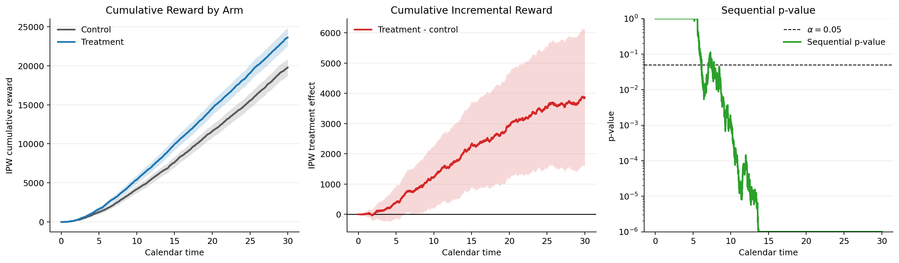

# Design-Based IPW Confidence Sequences

This directory contains a small reference implementation of the IPW confidence
sequence methodology from:

> Design-Based Anytime-Valid Inference for Randomized Experiments with Delayed
> Outcomes and Staggered Entry.

The arXiv preprint is available at <https://arxiv.org/abs/2603.25971>.

The implementation is intentionally minimal. It accepts a `pandas.DataFrame`
with one row per experimental unit and returns a `DataFrame` with one row per
input row, sorted by entry time. Each output row evaluates the cumulative reward
estimates and confidence sequences at that row's `entry_time`.

A runnable notebook version of the example is available in
[`example.ipynb`](example.ipynb).

## Input Format

The input dataframe must contain these columns:

| Column | Meaning |
| --- | --- |
| `entry_time` | Calendar time at which the unit entered the experiment. |
| `treatment` | Realized treatment assignment, usually `0` or `1`. |
| `propensity` | Probability of treatment, \(\pi_i(1)\). |
| `outcome_time` | Calendar time at which the delayed outcome was observed. |
| `outcome_value` | Reward observed at `outcome_time`, such as revenue. |

If a unit is right-censored or has not yet had an event, set `outcome_time` and
`outcome_value` to missing values (`NaN`, `None`, or `NaT`). Missing outcomes are
handled gracefully and contribute zero to the cumulative reward process at all
reported times.

## Example

```python
import numpy as np
import pandas as pd
import matplotlib.pyplot as plt

from delayed_ipw_cs import ipw_confidence_sequences


rng = np.random.default_rng(123)
n = 12000

entry_time = np.sort(rng.uniform(0, 30, size=n))
propensity = np.repeat(0.5, n)
treatment = rng.binomial(1, propensity)

# Treatment can affect delayed outcomes along three dimensions.  In this
# example it increases the probability of ever having a finite-time event and
# makes events arrive sooner, but it lowers the reward distribution conditional
# on an event.  The confidence sequence below is for the combined effect on
# cumulative incremental reward, not for any one dimension separately.
theta_control = 0.70
theta_treatment = 0.85
delay_scale_control = 6.0
delay_scale_treatment = 5.0
reward_mean_control = 1.00
reward_mean_treatment = 0.96

has_finite_event = np.zeros(n, dtype=bool)
for arm, theta in [(0, theta_control), (1, theta_treatment)]:
    arm_idx = np.flatnonzero(treatment == arm)
    n_finite = round(theta * len(arm_idx))
    finite_idx = rng.choice(arm_idx, size=n_finite, replace=False)
    has_finite_event[finite_idx] = True

delay = rng.exponential(
    scale=np.where(treatment == 1, delay_scale_treatment, delay_scale_control),
    size=n,
)
event_time = np.where(has_finite_event, entry_time + delay, np.nan)
outcome_value = np.where(
    has_finite_event,
    rng.lognormal(
        mean=np.where(treatment == 1, reward_mean_treatment, reward_mean_control),
        sigma=0.35,
        size=n,
    ),
    np.nan,
)

# Right censor finite-time events that occur after the end of observation.
censor_time = 30.0
observed = has_finite_event & (event_time <= censor_time)
event_time = np.where(observed, event_time, np.nan)
outcome_value = np.where(observed, outcome_value, np.nan)

df = pd.DataFrame(
    {
        "entry_time": entry_time,
        "treatment": treatment,
        "propensity": propensity,
        "outcome_time": event_time,
        "outcome_value": outcome_value,
    }
)

cs = ipw_confidence_sequences(df, alpha=0.05, eta2=1.0)
print(cs.head())
```

## Plotting the Confidence Sequences

```python
fig, axes = plt.subplots(1, 3, figsize=(15, 4), sharex=True)
x = cs["time"].to_numpy(dtype=float)
p_values = np.clip(cs["p_value"].to_numpy(dtype=float), 1e-6, 1.0)

axes[0].plot(x, cs["control_estimate"], label="Control", color="0.35")
axes[0].fill_between(
    x,
    cs["control_lower"],
    cs["control_upper"],
    color="0.35",
    alpha=0.20,
)
axes[0].plot(x, cs["treatment_estimate"], label="Treatment", color="C0")
axes[0].fill_between(
    x,
    cs["treatment_lower"],
    cs["treatment_upper"],
    color="C0",
    alpha=0.20,
)
axes[0].set_title("Cumulative Reward by Arm")
axes[0].set_xlabel("Calendar time")
axes[0].set_ylabel("IPW cumulative reward")
axes[0].legend()

axes[1].axhline(0, color="black", linewidth=1)
axes[1].plot(x, cs["effect_estimate"], label="Treatment - control", color="C3")
axes[1].fill_between(
    x,
    cs["effect_lower"],
    cs["effect_upper"],
    color="C3",
    alpha=0.20,
)
axes[1].set_title("Cumulative Incremental Reward")
axes[1].set_xlabel("Calendar time")
axes[1].set_ylabel("IPW treatment effect")
axes[1].legend()

axes[2].axhline(0.05, color="black", linestyle="--", linewidth=1, label=r"$\alpha = 0.05$")
axes[2].plot(x, p_values, label="Sequential p-value", color="C2")
axes[2].set_yscale("log")
axes[2].set_ylim(1e-6, 1.0)
axes[2].set_title("Sequential p-value")
axes[2].set_xlabel("Calendar time")
axes[2].set_ylabel("p-value")
axes[2].legend()

fig.tight_layout()
plt.show()
```

Running the example produces:



## Citation

```bibtex
@misc{lindon2026designbased,
  author = {Michael Lindon and Nathan Kallus},
  title = {Design-Based Anytime-Valid Inference for Randomized Experiments with Delayed Outcomes and Staggered Entry},
  year = {2026},
  eprint = {2603.25971},
  archivePrefix = {arXiv},
  primaryClass = {stat.ME},
  url = {https://arxiv.org/abs/2603.25971}
}
```

The treatment-effect confidence sequence is formed by constructing arm-level
confidence sequences at level `alpha / 2` and combining them with a union bound.

## Output Columns

The returned dataframe includes:

| Column | Meaning |
| --- | --- |
| `time` | Calendar time at which the row is evaluated. Equal to sorted `entry_time`. |
| `n_entered` | Number of units with `entry_time <= time`. |
| `control_events`, `treatment_events` | Observed events by arm with `outcome_time <= time`. |
| `control_estimate`, `treatment_estimate` | IPW cumulative reward estimates. |
| `control_variance`, `treatment_variance` | Plug-in variance clocks. |
| `control_lower`, `control_upper` | Control-arm confidence sequence. |
| `treatment_lower`, `treatment_upper` | Treatment-arm confidence sequence. |
| `effect_estimate` | `treatment_estimate - control_estimate`. |
| `effect_lower`, `effect_upper` | Union-bound confidence sequence for the treatment effect. |
| `p_value` | Sequential p-value for testing zero cumulative treatment effect. |
